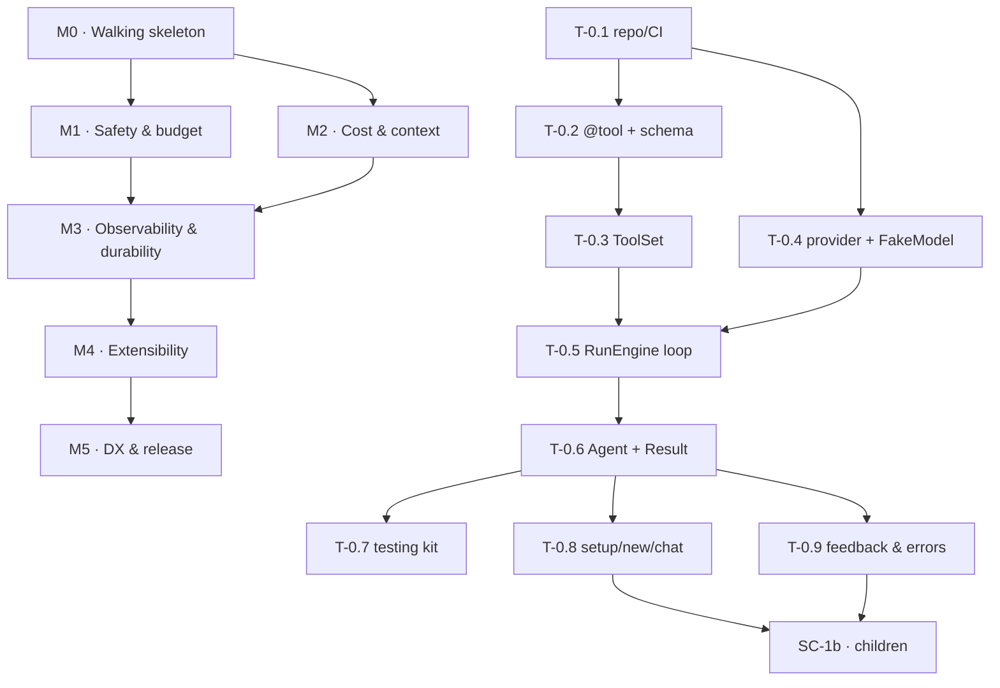

# 11 — Implementation Plan

**Shape:** 6 milestones, ~6 weeks with 2 engineers (or ~10 weeks with 1). Each milestone
ends in something that runs and is demonstrable — never in "the interfaces are done".

**Task format.** Every task states: *What · Why · Where · How · Depends · Contract ·
Failure · Test · Done.* If two engineers could read a task and build different things, the
task is not finished being written — raise it rather than guessing.

**Ordering rule.** M0 is a vertical slice, not a foundation layer. Interfaces are extracted
from working code, not written before it. This is deliberate: interfaces designed in the
abstract are wrong in ways you only discover when something calls them.

---

## Dependency graph

M1 and M2 are independent after M0 and can run in parallel across two engineers. That is
the intended split: one takes safety, one takes cost.

---

# M0 — Walking skeleton  *(week 1)*

**Goal.** Two things, both end to end. (1) `examples/01_hello.py` runs a real agent with a
real tool against the real API, and runs green in CI against `FakeModel`. (2) **A person
with no prior setup reaches a working agent in four commands**:
`pip install` → `harness setup` → `harness new` → `python joker.py`.

**Why (2) is in M0 and not M5.** Round 13 found that five of six beginner blockers live
outside the Python API — credentials, feedback, error rendering, scaffolding, repeat-run
cost. Left to M5 they become a documentation problem nobody can fix by then. They are
first-run experience, and first-run experience is built first or not at all.

**Why first.** A vertical slice on day 1 means every later task integrates into something
that already works. It also validates the riskiest assumption — that the loop shape is
right — before anything is built on top of it.

### T-0.1 — Repository, tooling, CI

- **What.** `src/` layout, `pyproject.toml`, `uv` lock, ruff, mypy strict, pytest, GitHub Actions on 3.11/3.12/3.13.
- **Why.** Every later gate hangs off this. Retrofitting `mypy --strict` at week 5 costs days.
- **Where.** Repo root, `.github/workflows/ci.yml`.
- **How.** PEP 621 metadata; runtime deps exactly `anthropic`, `typing-extensions`, `jsonschema`; extras `otel`/`cli`/`dev`; ship `py.typed`; commit the lockfile.
- **Depends.** —
- **Contract.** `uv run pytest`, `uv run mypy --strict src`, `uv run ruff check` all pass on an empty package.
- **Failure.** CI red blocks merge. No exceptions, no `# type: ignore` without a linked issue.
- **Test.** CI green on a trivial `test_imports`.
- **Done.** A PR from a fork runs the full matrix green in < 3 min.

### T-0.2 — `@tool` decorator and schema generation ★

- **What.** `@tool(effect=...)` turning a plain function into a `ToolSpec`, with JSON Schema derived from type hints.
- **Why.** The single most-used surface in the library. If this is awkward, nothing else matters.
- **Where.** `tools/__init__.py`, `tools/schema.py`.
- **How.** `inspect.signature` + `typing.get_type_hints(include_extras=True)`. Docstring summary → `description`; Google/NumPy-style `Args:` → per-property descriptions. Emit `additionalProperties: false` and a complete `required` list, and send every tool with **`strict: true`** (ADR-022) — the schema constraints exist to make that possible, so leaving it off wastes the work and a round trip per malformed call. Sync functions wrapped so `ToolSpec.fn` is always awaitable. Record `source` as `file:line` for error messages.
- **Depends.** T-0.1
- **Contract.** [§04.1](04-interfaces.md#1-tools) verbatim.
- **Failure.** Missing `effect` → `MissingEffectError` at decoration, with the four options and a name-based guess. Unsupported type → `ToolSchemaError` naming parameter and type. Bad name → `ToolSchemaError`. Missing/empty docstring → `ToolSchemaError`. **All at import; none at run time.**
- **Test.** Supported-type matrix (16 cases) → expected schema. Unsupported-type matrix (8 cases) → `ToolSchemaError` mentioning the parameter. Missing effect → message contains all four options. Sync and async both yield awaitable `fn`. Property P-4.
- **Done.** `@tool(effect="read") def add(a: int, b: int) -> int` produces the exact expected schema; every negative case raises at import with a message that names the offending symbol.

### T-0.3 — `ToolSet`

- **What.** Frozen, name-sorted collection with canonical serialization.
- **Why.** Deterministic tool rendering is a precondition for caching (ADR-004). Sorting here means the assembler cannot get it wrong later.
- **Where.** `tools/registry.py`.
- **How.** Backed by a **sorted tuple plus a name→spec dict**, never a `frozenset`: `ToolSpec` holds a `Mapping` and is therefore unhashable, and the name ordering a set would destroy is the ordering cache determinism depends on (ADR-004). `to_api()` returns tools sorted by name, serialized with `sort_keys=True` and fixed separators.
- **Depends.** T-0.2
- **Contract.** `to_api()` is byte-identical across processes and interpreter runs.
- **Failure.** Duplicate name → `DuplicateToolError` naming both `source` locations.
- **Test.** Property P-5. Insertion order does not affect output. Duplicate raises with both paths in the message. `ToolSpec` is unhashable (`TypeError` in a set) — AC-22.
- **Done.** Two `ToolSet`s built in different orders from the same tools serialize identically.

### T-0.4 — `ModelProvider` protocol, Anthropic adapter, `FakeModel`

- **What.** The provider seam plus its two first implementations.
- **Why.** Building the real adapter and the fake together is what proves the seam is real. A seam with one implementation is a guess.
- **Where.** `models/base.py`, `models/anthropic.py`, `models/fake.py`.
- **How.** Define the [§04.0](04-interfaces.md#0-core-value-types) value types (`Money`, `Usage`, `Step`, `ContentBlock`, `SystemBlock`, `DeltaFn`, `Reservation`, `EventKind`) first — everything downstream references them. Adapter wraps `anthropic.AsyncAnthropic`. Import the SDK lazily inside the constructor (NFR-01). `thinking={"type":"adaptive"}`, `output_config={"effort": ...}`; never send `budget_tokens`. Enable server-side refusal fallbacks by default. Map errors per [§10.3](10-observability-ops.md#3-provider-error-mapping). Surface `pause_turn` rather than swallowing it. `count_input_tokens` uses the provider's token-counting endpoint, memoized on `blake2b(canonical_json(request))` — **not** on the object, which is unhashable — reusing the assembler's canonical serializer so "the same request" has one definition in the system.
- **Depends.** T-0.1
- **Contract.** [§04.2](04-interfaces.md#2-model-provider).
- **Failure.** No vendor exception escapes the adapter. Unknown model in `price()` → `UnknownModelError`, never zero.
- **Test.** Error-mapping table (6 cases) against a stubbed HTTP layer. `FakeModel` records requests and replays scripts. Assert `budget_tokens` never appears in an outgoing request.
- **Done.** The same `RunEngine` runs unchanged against both implementations.

### T-0.5 — `RunEngine` — the loop ★★

- **What.** The state machine of [§02.3](02-architecture.md#3-the-run-loop).
- **Why.** The core of the product, and the only place invariants 2 and 3 can be enforced (ADR-001).
- **Where.** `run.py`.
- **How.** Follow the documented manual-loop shape exactly. Append `response.content` (not just text) to messages. Collect **all** `tool_result` blocks into **one** user message. Handle `pause_turn` by re-sending, capped at 5. Handle `refusal` as a terminal stop reason. In M0 the ledger and policy calls are present but stubbed to always-allow — the *call sites exist* so M1 fills in behavior, not structure.
- **Depends.** T-0.3, T-0.4
- **Contract.** Invariants I-1…I-4 of [§02.3](02-architecture.md#3-the-run-loop).
- **Failure.** A tool raising becomes an `is_error` result; the run continues. A missing `tool_result` is a bug, caught by P-3.
- **Test.** Integration suite against `FakeModel`: single step, multi-step, parallel calls, tool error, unknown tool, `pause_turn` resume, refusal, `max_tokens` truncation. Property P-3. **P-9: the provider→`StopReason` mapping is exhaustive over the protocol's value set, and an unrecognized value maps to `ERROR`, never to a success** (ADR-019).
- **Done.** All eight integration scenarios pass; the module is under 250 lines. **If it exceeds 250 lines, that is a design signal — stop and raise it, do not refactor around it.**

### T-0.6 — `Agent` and `Result`

- **What.** The frozen public facade and the return type.
- **Why.** The DX contract of [§03](03-public-api.md).
- **Where.** `agent.py`, `result.py`.
- **How.** Frozen dataclass, keyword-only `__init__`, validation in `__post_init__`. `run()`/`try_run()` sync facades over `arun()`/`atry_run()` via `asyncio.run`, guarded by a running-loop check. `with_()` returns a new instance.
- **Depends.** T-0.5
- **Contract.** [§03.3](03-public-api.md#3-agent--the-complete-signature) and [§03.5](03-public-api.md#5-result). `Result.__str__` returns the text so `print(agent.run(...))` works.
- **Failure.** Positional args → `TypeError`. Any mutation attempt → `FrozenInstanceError`. `.run()` inside a running loop → `SyncInAsyncContextError` naming `arun()`.
- **Test.** Keyword-only enforcement; immutability; `with_()` returns a new object and leaves the original untouched; sync-in-async detection; `run()` raises `RunFailed` with `.partial` while `try_run()` returns.
- **Done.** `examples/01_hello.py` runs against the real API and against `FakeModel` in CI.

### T-0.7 — `harness.testing`

- **What.** `FakeModel` re-export, `no_network()`, `record`/`replay`, assertion helpers.
- **Why.** Promoted to M0 in Round 3. A testing kit added later never gets used, and every subsequent task needs it.
- **Where.** `testing/__init__.py`, `conftest.py`.
- **How.** `no_network()` patches `socket.socket` to raise `NetworkAccessInTest`; registered as an **autouse** pytest fixture.
- **Depends.** T-0.4, T-0.6
- **Contract.** [§09.3](09-testing.md#3-harnesstesting).
- **Failure.** A test attempting a real call fails with a message explaining `no_network`.
- **Test.** A deliberate real-call test asserts it raises.
- **Done.** The whole suite runs with no network and no API key.

### T-0.8 — First-run experience: `setup`, `new`, `chat` ★

- **What.** The three CLI commands that stand between an empty folder and a working agent.
- **Why.** ADR-013. G13.1 is the true first wall, and it is not in the API at all.
- **Where.** `cli/setup.py`, `cli/new.py`, `cli/chat.py`.
- **How.** `setup` prompts for a key, **validates it with one minimal call before storing**, writes to `.env` at mode `0600` (environment variable wins when already present), and prints the provider's spend-limit URL. `new <name>` writes a commented, runnable agent file **and** a `.gitignore` containing `.env` — one command, both files. The scaffold includes `budget="$0.05"` with an explanatory comment. `chat <file>` loads the agent and runs a `Chat` loop until Ctrl-C.
- **Depends.** T-0.6
- **Contract.** [§03.7](03-public-api.md#7-the-cli). The scaffold file is byte-identical to the one shown in [§15](15-first-agent.md).
- **Failure.** An invalid key is rejected **at setup time** with the reason, never stored. If `.env` cannot be written, print the exact `export` line as a fallback rather than failing silently.
- **Test.** AC-15 (`.gitignore` always generated). AC-18 (no error string mentions `ANTHROPIC_API_KEY`; all say `harness setup`). Generated file runs against `FakeModel`. Invalid key rejected without writing.
- **Done.** On a clean container with only Python and a valid key, the four commands produce an answer.

### T-0.9 — Beginner-grade feedback and errors ★

- **What.** TTY progress · `Result.__str__` · filtered tracebacks · friendly positional-argument rejection · type-hint and `effect` typo messages.
- **Why.** ADR-014, ADR-015. G13.2–G13.5. Individually small; together they are the difference between "it works" and "I gave up".
- **Where.** `observe/console.py`, `result.py`, `run.py`, `agent.py`, `tools/schema.py`.
- **How.**
  - Progress: `ConsoleExporter` auto-attached when `sys.stdout.isatty()`. Writes to **stderr** (IDL-24) so redirecting stdout stays clean. Tool **names** only, never arguments.
  - `Result.__str__` returns `self.text`. No `__add__`.
  - Tracebacks: `run()` catches, drops harness-internal and `asyncio` frames from `__traceback__`, sets `__suppress_context__`, re-raises. **No global hook of any kind.** `HARNESS_FULL_TRACEBACK=1` restores. The unfiltered traceback still goes to the `error.raised` event.
  - `Agent.__init__(self, *args, name, job, ...)` — `*args` exists solely to raise a `ConfigError` printing the corrected call.
  - Unannotated tool parameter → `ToolSchemaError` showing the before/after edit and the four type words. **Never** default to `str` (IDL-22).
  - `effect=` typo → did-you-mean by edit distance.
- **Depends.** T-0.6, T-0.2
- **Contract.** Every message meets the four-part standard in [§03.8](03-public-api.md#8-error-message-standard).
- **Failure.** No global interpreter state is mutated at import — this is the whole point of ADR-015 and is asserted by AC-13.
- **Test.** AC-13, AC-14, AC-16, AC-17. Piped run produces zero progress bytes on stdout. Every message in the "When something goes wrong" section of [§15](15-first-agent.md) is asserted by a test against the rendered message body (the tutorial omits the exception class prefix, which is the only difference) — **the tutorial is the specification for these strings, not a paraphrase of them.**
- **Done.** All six message fixtures match [§15](15-first-agent.md) exactly; AC-13 green.

### T-0.10 — Streaming and cancellation ★

- **What.** `run(..., stream=on_delta)` end to end, and cooperative cancellation.
- **Why.** FR-17 and **FR-18 (a `Must`)**. Round 22 found neither had an owning task: cancellation was specified in [§02.6](02-architecture.md#6-concurrency-model), present in `StopReason`, and built by nobody. Both touch the loop, so they belong with the loop rather than bolted on at M5.
- **Where.** `run.py`, `models/anthropic.py`, `models/fake.py`.
- **How.** Streaming: the provider forwards text deltas to `DeltaFn`; **text only — never thinking, never tool input**. The callback is wrapped exactly as exporters are ([§04.6](04-interfaces.md#6-events--exporters)) so a raising callback cannot kill the run. Cancellation: `asyncio.CancelledError` propagates through the loop, cancels in-flight tool tasks, flushes the transcript, and returns `Result(stop_reason=CANCELLED)` with partial text. `CancelledError` is never converted into a tool error ([§04.1](04-interfaces.md#1-tools)).
- **Depends.** T-0.5, T-0.4
- **Contract.** [§03.3](03-public-api.md#3-agent--the-complete-signature); `DeltaFn` in [§04.0](04-interfaces.md#0-core-value-types).
- **Failure.** Cancelling mid-tool must not leave a `tool_use` without a `tool_result` in the persisted messages (invariant I-3) — the transcript is flushed with the run marked cancelled, and `resume` treats an interrupted `write`/`danger` per [§05.3](05-data-and-state.md#3-resume-semantics).
- **Test.** Cancel at each of 5 loop positions; every one returns `CANCELLED` with a valid transcript. A raising `on_delta` does not kill the run. Streamed text concatenates to `result.text` exactly.
- **Done.** All 5 cancel positions produce a parseable transcript; streaming round-trips byte-identically.

**M0 exit gate.** Example runs both ways · **four-command cold start works on a clean
machine** · full CI green · `mypy --strict` clean · `run.py` ≤ 250 lines.

---

# M1 — Safety & budget core  *(week 2)*

**Goal.** The 14 red-team scenarios pass, and the budget property test survives 1 000
adversarial runs.

### T-1.1 — Effect profiles ★

- **What.** `Effect`, `EffectProfile`, `EFFECT_PROFILES`; derive parallelism, retryability, taint, verdict and audit level.
- **Why.** ADR-003. One classification, five behaviors, nothing to forget or contradict.
- **Where.** `tools/__init__.py`.
- **How.** Module-level `Final` mapping. Not configurable — a user who could edit it could disable the taint rule.
- **Depends.** T-0.2
- **Contract.** [§04.1](04-interfaces.md#1-tools).
- **Failure.** No behavior may be overridable per tool except `accepts_tainted`.
- **Test.** Assert no public API accepts `parallel_safe`, `retryable`, or `requires_approval` (introspection test).
- **Done.** All four profiles behave as tabulated in the loop's scheduling and retry paths.

### T-1.2 — Policy engine and verdict lattice ★

- **What.** `Verdict`, `Decision`, `Policy`, `PolicyEngine`.
- **Why.** The only place tool execution is authorized. Restrict-only composition is what makes third-party policies safe to add.
- **Where.** `policy/base.py`, `policy/engine.py`.
- **How.** `Verdict(IntEnum)` composed with `max()`. Built-ins registered first and unremovable; user policies appended. Short-circuit on the first `DENY`. Emit `policy.decided` for **every** call including allows. **Approval is not a policy** (ADR-021): the engine awaits the `approve` callback after composition resolves to `ASK`, so `Policy.check` stays sync, pure and sub-millisecond.
- **Depends.** T-1.1
- **Contract.** [§04.3](04-interfaces.md#3-policy--verdicts).
- **Failure.** A policy raising is treated as `DENY` and emits `error.raised` — fail closed. A policy exceeding 1 ms warns in debug mode.
- **Test.** Property P-2 (adding a policy never loosens). RT-11. Raising policy → denied, not crashed.
- **Done.** P-2 holds over 1 000 generated policy lists.

### T-1.3 — Taint tracker and built-in policies ★★

- **What.** `TaintTracker`; `EffectPolicy`, `TaintPolicy`, `EgressPolicy`; plus the engine's approval-resolution step (ADR-021 — *not* a policy).
- **Why.** ADR-011 — the central safety mechanism.
- **Where.** `policy/taint.py`, `policy/builtin.py`.
- **How.** Taint is sticky per run, raised when an `external` tool result is appended, and emits `taint.raised` once. `TaintPolicy` denies `danger` unless `accepts_tainted`. `EgressPolicy` extracts host arguments by schema (any property whose name or format indicates a URL/host) and checks `allowed_hosts`. Surviving `ASK` verdicts are resolved by the engine, which may await an async callback — a policy cannot, and must not.
- **Depends.** T-1.2
- **Contract.** [§06.3](06-safety.md#3-the-taint-lattice--the-designs-central-safety-idea).
- **Failure.** Denial is not a crash: an `is_error` tool result goes back to the model so it can choose another route. With no `approve` callback, `ASK` on `danger` → `DENY` with a one-time warning.
- **Test.** RT-01, RT-02, RT-03, RT-14. Taint is sticky. Base64 encoding does not evade it (the rule is capability-based, not textual).
- **Done.** All four scenarios blocked; the run continues rather than crashing.

### T-1.4 — Construction-time unsafe-tool-set check ★

- **What.** `Agent.__init__` rejects an `external` + `danger` combination unless the danger tool declares `accepts_tainted`.
- **Why.** F9.1 — without this, the beginner discovers the taint rule mid-run, after spending money.
- **Where.** `agent.py`.
- **How.** Set intersection over `tools`. Error text is the block in [§06.3](06-safety.md#caught-at-construction-not-at-run-time), verbatim, naming the two specific tools.
- **Depends.** T-1.3
- **Contract.** Raises `UnsafeToolSetError`; never a warning.
- **Failure.** —
- **Test.** RT-04. Message names both tools and prints both remedies.
- **Done.** `Agent(tools=[search, send_email])` raises before any network call.

### T-1.5 — Budget and ledger ★★

- **What.** `Budget`, `Budget.parse`, `Ledger`, `reserve`/`settle`.
- **Why.** ADR-005. Invariant 2 lives here.
- **Where.** `budget/ledger.py`.
- **How.** `Decimal` throughout; a lint rule bans `float` in this package. **`size_call()` derives `max_tokens` from the remaining budget (ADR-017)** — `max_tokens` is never user-supplied and never a constant. `reserve()` uses the worst-case estimate of [§07.1](07-cost.md#1-the-budget-is-a-ceiling-not-an-alert), computed from that derived figure, and runs immediately before `provider.complete` with nothing between them. `settle()` corrects from `response.usage`. `Budget.parse` accepts `"$0.10"`, `"10 cents"`, `"5 steps"`, `"$1, 50 steps, 10m"`.
- **Depends.** T-0.4
- **Contract.** [§04.4](04-interfaces.md#4-budget--ledger).
- **Failure.** Insufficient budget → graceful `Result(BUDGET_EXHAUSTED)` with partial text; never an exception from `try_run`. Unparseable string → `InvalidBudgetError` at construction listing accepted forms. `Budget(usd=None)` warns every run.
- **Test.** **Property P-1 over 1 000 adversarial runs — SC-2.** Parser table (12 cases). No `float` in the module (AST test). Reserve-before-call ordering asserted by an event-sequence test. **P-8: for every (budget, model, input size) in the cross-product of shipped defaults and documented examples, `reserve()` succeeds and the derived `max_tokens` is ≥ 256** — the Round 17 regression test. A budget affording < 256 output tokens stops rather than calling.
- **Done.** P-1 and P-8 green; `budget/` at 100 % coverage; **the [§15](15-first-agent.md) scaffold's `budget="$0.05"` demonstrably makes a call.**

### T-1.6 — `Secret` and redaction

- **What.** `Secret` type; transcript redaction pass; entropy scan.
- **Where.** `secrets.py`, `observe/redact.py`.
- **How.** Override `__repr__`/`__str__`/`__format__`/`__reduce__`; raise on JSON encode. **`__hash__ = None`** (IDL-32). The redactor holds a **`WeakSet`** of live secrets (IDL-33) and reads values at redaction time. Redaction happens on write, before bytes exist. Entropy scan matches known key prefixes.
- **Depends.** T-0.1
- **Contract.** [§06.5](06-safety.md#5-secrets).
- **Failure.** An unwrapped key detected in output → `error.raised` warning naming the event, value still redacted.
- **Test.** RT-08, RT-09, RT-13, RT-15, RT-16. Render matrix: `repr`, `str`, f-string, `%`, `logging`, `pprint`, `json.dumps`, traceback. Hash contract: `Secret` raises `TypeError` in a set, a dict key, and as an `lru_cache` argument. Registry: a secret that goes out of scope is no longer retained (garbage-collect and assert the `WeakSet` shrank).
- **Done.** No render path emits the value.

**M1 exit gate.** 14/14 red team · P-1 and P-2 green · `budget/` and `policy/` at 100 %
coverage.

---

# M2 — Cost & context  *(week 3, parallel with M1)*

**Goal.** ≥ 90 % cache reads on turns 3+ of the 10-turn fixture (SC-4), and a
`datetime.now()` in a system prompt fails at construction.

### T-2.1 — Pricing table

- **What.** Per-model `Price` table with an `as_of` date, plus `Decimal` cost arithmetic.
- **Why.** The budget ceiling is only as correct as the prices. Round 12 found nobody owned this.
- **Where.** `models/pricing.py`.
- **How.** Module constant with explicit `as_of`. `price()` raises `UnknownModelError` for anything unlisted.
- **Depends.** T-0.4
- **Contract.** Never returns zero for an unknown model.
- **Failure.** A CI job fails when `as_of` is older than 90 days, with instructions to verify against published pricing.
- **Test.** RT-12. Freshness gate. Cost arithmetic against hand-computed fixtures.
- **Done.** Freshness gate wired into CI.

### T-2.2 — Context assembler ★★

- **What.** Deterministic rendering of `tools` → `system` → `messages`.
- **Why.** ADR-004. Every cost guarantee depends on byte-stability here.
- **Where.** `context/assembler.py`.
- **How.** Canonical JSON everywhere. Tools sorted by name. System prompt assembled once at construction from frozen inputs. No timestamps, no UUIDs, no iteration over unordered collections anywhere in the path.
- **Depends.** T-0.3
- **Contract.** Rendering identical inputs twice yields identical bytes, across processes.
- **Failure.** Any non-determinism is a bug caught by T-2.3.
- **Test.** Cross-process byte equality. Property P-5. 100 % coverage required.
- **Done.** Identical bytes across two interpreter processes.

### T-2.3 — Cache linter ★

- **What.** Double-render byte comparison at `Agent.__init__`.
- **Why.** Register #28 — converts the most expensive invisible bug in LLM apps into a construction-time exception.
- **Where.** `context/linter.py`.
- **How.** Render, wait 150 ms, render again, byte-compare. On difference, locate the differing range, identify the section, emit the message in [§07.2.1](07-cost.md#21-the-cache-linter) with a caret marker.
- **Depends.** T-2.2
- **Contract.** Runs on every construction; adds < 5 ms when the prompt is static. Disableable only via `HARNESS_SKIP_CACHE_LINT=1`, documented for tests.
- **Failure.** `NonDeterministicPromptError` with the differing byte range and the fix.
- **Test.** A prompt containing `datetime.now()` raises with the offset in the message; a static prompt does not; overhead measured.
- **Done.** The negative case raises with a message a newcomer can act on without reading source.

### T-2.4 — Cache breakpoints

- **What.** `cache_control` placement per [§07.2.2](07-cost.md#22-breakpoint-placement).
- **Where.** `context/caching.py`.
- **How.** One breakpoint on the last system block; one on the last content block of the most recent turn for multi-turn. Count tokens first and **omit all markers** when the prefix is under the minimum cacheable size — a marker there only pays the write premium. Never exceed 4.
- **Depends.** T-2.2, T-2.1
- **Contract.** ≤ 4 breakpoints; none below the minimum prefix size.
- **Failure.** Zero cache reads after step 3 with a large prefix → loud `error.raised{where:"cache"}`.
- **Test.** **Benchmark: ≥ 90 % cache reads on turns 3+ of the 10-turn fixture (SC-4).** Small-prefix case emits no markers.
- **Done.** Benchmark green in CI against a recorded fixture.

### T-2.5 — Result truncation and duplicate detection

- **What.** `max_result_tokens` truncation; duplicate-call suppression within a step.
- **Where.** `tools/invoke.py`.
- **How.** Truncate at a token boundary, never mid-UTF-8-character, and suffix `[truncated: N of M tokens shown]` so the model knows. Duplicate detection hashes `(name, canonical(arguments))` within a step; the second identical call returns the cached result and emits a warning.
- **Depends.** T-0.5
- **Contract.** Truncated output is always valid UTF-8 and, when the result was JSON, valid JSON or explicitly marked as truncated text.
- **Failure.** A 50 MB result must not raise and must not grow memory beyond the cap.
- **Test.** RT-05. Property P-7. Memory flat under a 50 MB result.
- **Done.** RT-05 passes with bounded memory.

### T-2.6 — Context window management

- **What.** Editing at 60 %, compaction at 80 %.
- **Where.** `context/window.py`.
- **How.** Editing clears old tool results, oldest first, preserving the last 3 steps. Compaction appends `response.content` back **verbatim**, including compaction blocks — extracting only the text silently loses the compaction state. Emit `context.managed`. **Fixtures are specified per model** ([§07.3](07-cost.md#3-token-discipline)): on Opus at the default budget the budget ends the run before compaction triggers, so a fixture built from the defaults would never exercise this code. Use a large-budget Opus fixture and a default-budget Haiku fixture.
- **Depends.** T-2.2
- **Contract.** Editing is always attempted before compaction.
- **Failure.** If compaction fails, the run stops with a clear error rather than sending an over-length request.
- **Test.** Fixture conversation crossing both thresholds; assert compaction blocks are preserved across turns.
- **Done.** Both fixtures complete without exceeding the context window, and each demonstrably reaches the code path it was built for.

### T-2.7 — Parallel tool scheduling

- **What.** Concurrent execution of parallel-safe calls under a semaphore.
- **Where.** `run.py`, `tools/invoke.py`.
- **How.** Partition by `EFFECT_PROFILES[...].parallel_safe`. `asyncio.gather` for the safe set under `max_parallel_tools`; serial for the rest. Results reassembled **in the model's original call order** before being appended.
- **Depends.** T-1.1, T-0.5
- **Contract.** Invariant I-4 — one user message with all results, in call order.
- **Failure.** One tool failing must not cancel its siblings (`return_exceptions=True`).
- **Test.** N independent reads complete in ~1/N the serial time; result order preserved; one failure does not affect others.
- **Done.** Timing test shows the expected speedup.

**M2 exit gate.** SC-4 benchmark ≥ 90 % · cache linter catches the `datetime.now()` case ·
`context/assembler.py` at 100 % coverage.

---

# M3 — Observability & durability  *(week 4)*

### T-3.1 — Event taxonomy and bus

- **What.** The 15 `EventKind`s, `Event`, `EventBus`.
- **Where.** `observe/events.py`, `observe/bus.py`.
- **How.** Closed enum. Synchronous ordered fan-out. Each exporter wrapped: an exception becomes one `error.raised` and disables that exporter for the run.
- **Depends.** T-0.5
- **Contract.** [§05.1](05-data-and-state.md#1-the-event-taxonomy-closed). `seq` monotonic and gap-free.
- **Failure.** A broken exporter must never affect the run.
- **Test.** A raising exporter is disabled and the run completes. Payload schema conformance per kind.
- **Done.** Every kind emitted at least once by the integration suite.

### T-3.2 — Transcript writer and reader

- **What.** Append-only JSONL with redaction and fsync policy.
- **Where.** `observe/transcript.py`.
- **How.** Redact on write. `fsync` on `run.finished`, on `error.raised`, and every 64 events. `tool.requested` stores an argument **digest** unless `transcript_level="debug"`.
- **Depends.** T-3.1, T-1.6
- **Contract.** [§05.2](05-data-and-state.md#2-transcript-format).
- **Failure.** A full or unwritable disk emits a warning and disables the transcript — it never kills the run.
- **Test.** Crash mid-run leaves a valid, parseable prefix. Secrets absent from the file. Arguments absent at default level.
- **Done.** A `kill -9` fixture produces a readable transcript.

### T-3.3 — Resume

- **What.** `Agent.resume(transcript)`.
- **Where.** `run.py`, `observe/transcript.py`.
- **How.** Replay to reconstruct messages, spend, step count and taint. `read`/`external` interrupted calls re-execute; `write`/`danger` return `is_error("interrupted; not retried automatically")`.
- **Depends.** T-3.2
- **Contract.** [§05.3](05-data-and-state.md#3-resume-semantics).
- **Failure.** A transcript from a newer major version is refused explicitly, not partially parsed.
- **Test.** Kill at each step of a 10-step fixture; resume completes correctly in all 10. A `write` interrupted mid-call is never re-executed.
- **Done.** All 10 kill points resume correctly.

### T-3.4 — Console and OTel exporters

- **What.** Human-readable console output; OTel spans and metrics.
- **Where.** `observe/console.py`, `observe/otel.py`.
- **How.** Mapping in [§10.2](10-observability-ops.md#2-opentelemetry-mapping). Content excluded unless `include_content=True`. OTel is an optional extra and must not be imported unless configured.
- **Depends.** T-3.1
- **Contract.** Never exports prompt or completion text by default.
- **Test.** Span tree shape against an in-memory OTel exporter. Import-time test proves OTel is not imported by default.
- **Done.** A run produces the expected span tree; `import harness` does not import OTel.

### T-3.5 — Golden replay harness

- **What.** `record`/`replay` plus 30 fixtures.
- **Where.** `testing/`, `tests/golden/`.
- **Depends.** T-3.2
- **Contract.** Property P-6 — replay reproduces the event stream byte for byte.
- **Test.** All 30 fixtures replay identically; an intentional loop change produces a readable diff.
- **Done.** Fixtures committed and green.

### T-3.6 — The conformance suite ★★

- **What.** All 25 `AC-nn` checks in [§14.4](14-validation-plan.md#4-architecture-conformance-tests), plus AC-26.
- **Why.** Round 22 found 18 of them specified and owned by nobody — including **AC-04 and AC-05**, the AST assertions that every model call is preceded by a budget reservation and every tool execution by a policy verdict. Those two are the executable form of the entire safety and cost argument. A test that no task creates does not exist.
- **Where.** `tests/conformance/`.
- **How.** Mostly AST analysis over `src/harness` plus an import-linter contract. AC-04 and AC-05 walk the call graph of `run.py` and assert the adjacency on **every** path, not only paths a behavioral test happens to exercise — which is exactly where a security check gets bypassed. **AC-26** re-runs the Round 22 sweep: every FR, NFR, RT and AC must appear in the traceability matrix below with an owning task.
- **Depends.** T-1.5, T-1.2, T-2.2, T-0.9
- **Contract.** [§14.4](14-validation-plan.md#4-architecture-conformance-tests).
- **Failure.** A conformance failure blocks merge and is never skipped — these are the tests that catch architectural drift, which is by definition the thing no ordinary test notices.
- **Test.** Each AC has a negative fixture proving it fails when the property is violated. **A conformance test that cannot be made to fail is not testing anything.**
- **Done.** 26/26 green, each with a passing negative fixture.

**M3 exit gate.** SC-7 (byte-identical replay) · 10/10 resume points · exporter isolation
proven.

---

# M4 — Extensibility  *(week 5)*

### T-4.1 — Plugin registry

- **What.** Explicit registration; opt-in entry-point discovery; capability ceiling; `API_VERSION` checks.
- **Where.** `plugins/registry.py`.
- **How.** Default is explicit registration only. `Agent(discover=True)` loads the `harness.plugins` entry-point group. A plugin declares its maximum effect class; registering above it raises.
- **Depends.** T-1.1
- **Contract.** [§06.6](06-safety.md#6-plugin-trust-boundary--stated-honestly).
- **Failure.** Version mismatch or ceiling violation raises at registration, never at run time.
- **Test.** RT-10. Discovery off by default (a test package installed in the test env is *not* loaded without `discover=True`).
- **Done.** RT-10 passes; discovery proven off by default.

### T-4.2 — `Store` protocol, in-memory and SQLite

- **What.** The memory seam and its two implementations.
- **Where.** `memory/`.
- **How.** Schema in [§05.5](05-data-and-state.md#5-memory-schema-sqlite). `STRICT` tables, WAL, busy timeout, FTS5 search, expiry enforced on read as well as by sweep, `schema_meta.version` checked at open.
- **Depends.** T-0.1
- **Contract.** [§04.5](04-interfaces.md#5-store).
- **Failure.** A newer schema raises rather than guessing. A locked database retries within the busy timeout, then raises a clear error.
- **Test.** Same conformance suite runs against both implementations. Concurrent access from two connections. Expiry honored before the sweep runs.
- **Done.** One conformance suite, two implementations, both green.

### T-4.3 — Memory tools

- **What.** `remember` (write) and `recall` (read) built-in tools.
- **Where.** `tools/builtin/memory.py`.
- **How.** Thin wrappers over `ctx.memory`. **Memory is never auto-injected** into the prompt — auto-injection would grow the prefix, void the cache, and raise cost on every call.
- **Depends.** T-4.2
- **Test.** Recall across two runs sharing a store. Assert the system prompt is unchanged by memory content.
- **Done.** Cross-run recall works and the prefix is provably unaffected.

### T-4.3b — `Chat` session ledger

- **What.** `agent.chat(budget=...)` with **one ledger for the whole session**.
- **Why.** ADR-020. Left undefined, `harness chat` is either unbounded across turns or dies after three.
- **Where.** `agent.py`, `run.py`, `cli/chat.py`.
- **How.** Default session budget is 10 × the agent's run budget, shown in the `harness chat` banner. Each turn draws from the shared ledger; ADR-017's derived `max_tokens` shrinks as it depletes, so answers shorten before the session ends.
- **Depends.** T-1.5, T-0.8
- **Contract.** [§03.3](03-public-api.md#3-agent--the-complete-signature).
- **Failure.** Exhaustion ends the chat with a message naming the spend and how to raise it — never a silent stall.
- **Test.** An 80-turn chat never exceeds the session budget (extends P-1). Answers demonstrably shorten as it depletes.
- **Done.** `harness chat` shows the session budget and degrades gracefully.

### T-4.3c — Structured output (`returns=`)

- **What.** `Agent(returns=SomeType)` → `result.value` of that type, validated.
- **Why.** ADR-022. Invariant 4 had no implementation; this and strict mode are the two non-speculative contributions to it. Removes the parse-fail-and-re-prompt loop.
- **Where.** `agent.py`, `models/anthropic.py`, `context/assembler.py`.
- **How.** Generate a JSON Schema from the type with the **same** generator as `tools/schema.py` — one definition of "Python type → schema" in the system. Set `output_config.format` on the request. Validate the response and populate `Result.value`.
- **Depends.** T-0.2, T-0.4
- **Contract.** [§03.5](03-public-api.md#5-result). `value` is `None` when `returns=` is unset.
- **Failure.** An unsupported `returns=` type raises `ToolSchemaError` **at construction**, reusing T-0.2's messages. A response that fails validation is a `ProviderBadRequest`, not a silent `None`.
- **Test.** Round-trip a dataclass, a `TypedDict` and a `pydantic.BaseModel`. Unsupported type raises at construction. SC-8.
- **Done.** `result.value` is typed and validated; the schema generator is shared with tools, not duplicated.

### T-4.4 — Subagents ★

- **What.** `Agent.as_tool()`.
- **Where.** `agent.py`.
- **How.** Wrap the child as a `ToolSpec` whose `effect` is the **maximum** of the child's tool effects. The child's budget is capped at the parent's remaining budget; the child's safety level cannot be lower than the parent's. The child gets an explicit, minimal context — never the parent transcript. The child's spend settles into the parent ledger.
- **Depends.** T-1.5, T-0.6
- **Contract.** [§06.4](06-safety.md#4-least-privilege) — subagents inherit restriction only.
- **Failure.** A child that would exceed the parent budget stops gracefully; the parent sees a partial result, not a crash.
- **Test.** Parent budget is never exceeded by child spend (extends P-1). A child cannot hold a tool the parent's policies would deny. Effect maximum is computed correctly.
- **Done.** The research/reader example from [§07.4](07-cost.md#4-model-spend) runs and demonstrably costs less than a single-agent equivalent on the same fixture.

### T-4.5 — Out-of-tree plugin examples

- **What.** One working external example per seam (5 total).
- **Where.** `examples/plugins/`.
- **Why.** SC-6. An extension point without an out-of-tree example is an untested claim.
- **Depends.** T-4.1
- **Done.** All five install and run in CI from outside the package.

**M4 exit gate.** SC-6 (5/5 seams) · subagent cost saving demonstrated · discovery off by
default.

---

# M5 — DX, documentation, release  *(week 6)*

### T-5.1 — CLI, remaining commands

`harness run`, `trace`, `cost`, `doctor` (`setup`, `new` and `chat` shipped in T-0.8).
`doctor` checks version, key presence, pricing-table age, cache determinism for a given
agent module, and plugin API compatibility. **Depends.** T-3.2. **Done.** Each subcommand
has an integration test; `doctor` output is the standard bug-report attachment.

### T-5.2 — Error-message pass ★

Every `ConfigError` subclass reviewed against the four-part standard in
[§03.7](03-public-api.md#8-error-message-standard), with a conformance test. **Why.** Error
messages are the API for anyone who has made a mistake — which is everyone, on day one.
**Done.** Conformance test green for all 7 subclasses.

### T-5.3 — Documentation, two audiences ★

**Two separate deliverables, not one document with a beginner section.** Round 15 found the
original single-track plan did not satisfy the revised requirement at all.

1. **[§15 — Your First Agent](15-first-agent.md)**, shipped as the child-facing quickstart.
   It is already written; this task is to publish it, keep the six error-message fixtures in
   T-0.9 synchronized with it, and run it past a non-programmer reader before SC-1b.
2. **Developer docs:** README (five-line agent above the fold), four guides (tools, safety,
   cost, testing), the [§03.2](03-public-api.md#2-progressive-disclosure-ladder) ladder as
   the site's spine, an API reference, and a plugin-authoring guide **opening with the
   trust-boundary statement verbatim**.

Every `__all__` symbol has a runnable docstring example, executed in CI (NFR-10).
**Done.** Docs build with zero broken links; examples execute; every error string in §15
is covered by a T-0.9 test.

### T-5.4 — Beginner validation, both populations ★★

Run the SC-1 protocol of [§14.2](14-validation-plan.md#2-sc-1--time-to-first-agent).

- **SC-1a:** 5 developers, README only, observed, no help. Median ≤ 10 min, ≥ 4/5 unaided.
- **SC-1b:** **3 children aged 10–12 with a basic Python course behind them**, given
  [§15](15-first-agent.md) only. An adult may read words aloud and perform the account step,
  and may not explain, debug or type. Pass: ≥ 2/3 reach a working agent in ≤ 20 min **and
  ≥ 2/3 add a tool of their own.**

The second half of SC-1b is the real test. Running a provided example proves the example
works; writing a tool is where `@tool`, type hints and `effect=` are actually met.

**A miss on either blocks 1.0 and reopens the council on the API — not on the tutorial.**
Every confusion point is logged verbatim and mapped to a [§08](08-poka-yoke.md) entry; a
confusion with no entry means the register has a gap.
**Done.** Both thresholds met, or the API changed and re-measured.

### T-5.5 — Release engineering

Trusted Publishing to PyPI, generated changelog, `1.0.0-rc1` → soak → `1.0.0`. **Done.**
`pip install harness` works in a clean environment and the five-line example runs.

**M5 exit gate.** SC-1 met · docs build clean · `1.0.0-rc1` on PyPI.

---

## Task index

★ = needs the most experienced person available. ★★ = needs review by two.

| Task | ★ | Milestone | Blocks |
|---|:--:|---|---|
| T-0.2 `@tool` + schema | ★ | M0 | everything |
| T-0.5 RunEngine | ★★ | M0 | everything |
| T-1.1 Effect profiles | ★ | M1 | T-1.2, T-2.7, T-4.4 |
| T-1.2 Policy lattice | ★ | M1 | T-1.3 |
| T-1.3 Taint + built-ins | ★★ | M1 | T-1.4 |
| T-1.4 Unsafe tool set | ★ | M1 | — |
| T-1.5 Budget ledger | ★★ | M1 | T-4.4 |
| T-2.2 Assembler | ★★ | M2 | T-2.3, T-2.4 |
| T-2.3 Cache linter | ★ | M2 | — |
| T-4.4 Subagents | ★ | M4 | — |
| T-0.8 First-run CLI | ★ | M0 | SC-1b |
| T-0.10 Streaming & cancel | ★ | M0 | FR-17, FR-18 |
| T-3.6 Conformance suite | ★★ | M3 | every ADR |
| T-0.9 Feedback & errors | ★ | M0 | SC-1b |
| T-5.2 Error messages | ★ | M5 | T-5.4 |
| T-5.3 Docs, two audiences | ★ | M5 | T-5.4 |
| T-5.4 Beginner validation | ★★ | M5 | 1.0 |

## Traceability matrix

Added in Round 22, after a sweep found a `Must` requirement and 18 conformance tests that no
task owned. **A numbered thing with no owner is nobody's job.** AC-26 re-runs this check in
CI, because it drifts the moment someone adds a requirement without a task.

| Artifact | Owning task |
|---|---|
| FR-01, FR-02 | T-0.5, T-0.6 |
| FR-03 | T-4.3b |
| FR-04, FR-25 | T-0.2 |
| FR-05 | T-1.1 |
| FR-06 | T-1.5 |
| FR-07 | T-1.2 |
| FR-08 | T-1.3 |
| FR-09 | T-1.2 (engine resolution — approval is not a policy, ADR-021) |
| FR-10 | T-3.1, T-3.2 |
| FR-11 | T-3.3 |
| FR-12 | T-4.4 |
| FR-13 | T-4.2, T-4.3 |
| FR-14 | T-2.6 |
| FR-15 | T-4.1 |
| FR-16 | T-0.8, T-5.1 |
| **FR-17, FR-18** | **T-0.10** *(unowned until Round 22; FR-18 is a `Must`)* |
| FR-19, FR-22 | T-0.8 |
| FR-20, FR-21 | T-0.9 |
| FR-23 | T-1.5 |
| FR-24 | T-0.2 |
| NFR-01 | T-0.4 (lazy SDK import) |
| NFR-02, NFR-03 | T-3.6 benchmarks |
| NFR-04, NFR-05 | T-0.1 |
| NFR-06 | T-0.1 (CI matrix 3.11 / 3.12 / 3.13) |
| NFR-07 | T-3.5 |
| NFR-08 | T-0.5 |
| NFR-09 | T-2.7 (`max_parallel_tools`, default 8) |
| NFR-10 | T-5.3 |
| RT-01…04, RT-14 | T-1.3, T-1.4 |
| RT-05 | T-2.5 |
| **RT-06, RT-07** | **T-0.5** *(step limit; unknown tool requested)* |
| RT-08, RT-09, RT-13, RT-15, RT-16 | T-1.6 |
| RT-10 | T-4.1 |
| RT-11 | T-1.2 |
| RT-12 | T-2.1 |
| **RT-17** | **T-1.2** *(policy performing I/O — timing assertion)* |
| **AC-01…26** | **T-3.6** *(18 of them unowned until Round 22)* |
| P-1…P-9 | T-1.5, T-1.2, T-0.5, T-0.2, T-0.3, T-3.5, T-2.5 |
| SC-1a, SC-1b | T-5.4 |
| SC-2 | T-1.5 · SC-3 | T-1.3 · SC-4 | T-2.4 |
| SC-5 | T-0.7 · SC-6 | T-4.5 · SC-7 | T-3.5 · SC-8 | T-0.2, T-4.3c |

## Global Definition of Done

A task is done when **all** hold:

1. Code merged, matching the contract in [§04](04-interfaces.md) exactly.
2. Every test listed in the task passes.
3. All CI gates in [§09.6](09-testing.md#6-ci-gates) green.
4. Public symbols have runnable docstring examples.
5. Any deviation from this plan is recorded in the [Implementation Decision Log](12-decision-logs.md).
6. No new `# type: ignore` without a linked issue.
7. If the task changed the public API, `__all__` and the changelog are updated in the same PR.
